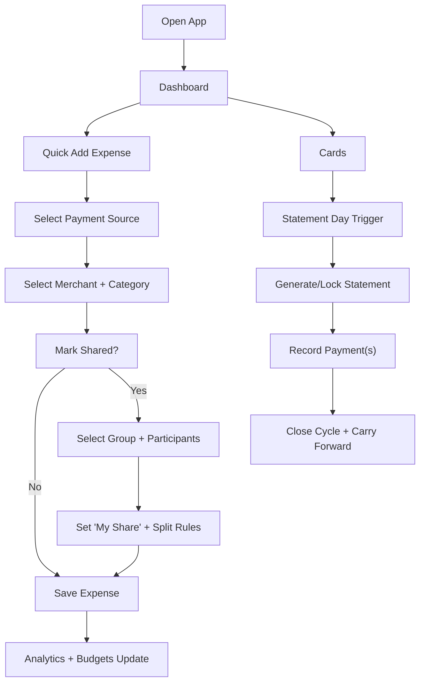

## 1. Product Overview
A premium, mobile-first personal + shared expense tracker with multi-card credit workflows and smart monthly clearing.
It helps individuals and groups track true personal share, manage card statements like a modern fintech app, and get actionable insights.

## 2. Core Features

### 2.1 User Roles
| Role | Registration Method | Core Permissions |
|------|---------------------|------------------|
| Owner User | Google / Apple / Email | Full access to personal data, cards, groups, reports, export |
| Group Member (Invited) | Email / Link + optional OAuth | View and settle within shared groups they belong to |

### 2.2 Feature Modules
1. **Landing**: product value, screenshots/preview, security + privacy positioning, call-to-action
2. **Authentication**: Google, Apple, Email login; session persistence; device-friendly flows
3. **Dashboard**: monthly summary cards, due alerts, quick insights, trends, quick-add
4. **Fast Add Expense**: one-screen quick entry with smart defaults + autocomplete
5. **Expense History**: searchable list, filters, edit, delete, receipts, bulk actions
6. **Shared / Groups**: Splitwise-like groups, balances, settlements, activity feed
7. **Analytics**: category distribution, trends, heatmap, shared vs personal split, card usage
8. **Cards**: multi-card setup, billing cycle, statement locking, payments, carry-forward
9. **Monthly Reports**: monthly close, export, reconciliation, archive
10. **Categories & Tags**: custom categories, subcategories, tags; merchant mapping rules
11. **Notifications**: due reminders, budget warnings, anomalies, subscription renewals
12. **Settings & Profile**: profile, currency, budgets, privacy, data export/import, integrations

### 2.3 Page Details
| Page Name | Module Name | Feature description |
|-----------|-------------|---------------------|
| Landing | Hero + CTA | Value proposition, clean premium marketing layout, sign-in CTA |
| Login/Register | OAuth + Email | Google/Apple providers, email login, session persistence |
| Dashboard | Summary Cards | Total monthly spending, personal vs shared, actual user share, budgets, card dues |
| Dashboard | Smart Insights | Weekly trends, month-over-month deltas, top merchants, anomaly highlights |
| Dashboard | Quick Actions | Floating quick-add, recent expenses, repeat expense chips |
| Add Expense | Amount + Merchant | Amount, merchant search/autocomplete, recent merchants, receipt upload |
| Add Expense | Payment Source | Credit/debit/UPI/cash, card selection, smart default from recents |
| Add Expense | Categorization | Category, subcategory, tags, notes, recurring toggle |
| Add Expense | Shared Split | Toggle shared, pick group/participants, define user share, auto remainder split |
| Expense History | Search + Filters | Global search, filters by month/card/category/shared/merchant/tags |
| Expense History | Editing | Inline edit, split edit, move between cards/months with audit trail |
| Shared Expenses | Groups | Group list, create/join, members, balances, monthly summary |
| Shared Expenses | Settlements | Who owes whom, settle up, mark paid, export settlement history |
| Analytics | Visualizations | Pie/bar/line charts, heatmaps, progress rings, animated budget indicators |
| Analytics | Shared vs Personal | Separate views of paid amount vs actual share vs receivable |
| Cards | Card Setup | Name, issuer, last4, limit, billing cycle, due date, statement day |
| Cards | Statement Workflow | Statement lock, auto statement generation, archived months, carry-forward |
| Cards | Payments | Payment history, partial payments, remaining due, reminders |
| Monthly Reports | Monthly Close | Review + lock month, generate report, export (PDF/CSV/XLSX) |
| Categories & Tags | Merchant Rules | Merchant memory, auto categorization rules, editable mappings |
| Notifications | Rules | Due reminders, overspending alerts, anomaly/subscription notices |
| Settings/Profile | Security + Data | Privacy controls, account deletion, export all data, API keys (if any) |

## 3. Core Process

### 3.1 Daily Personal Expense
- User opens quick-add from bottom nav
- App preselects last used payment source + category based on merchant
- User enters amount and confirms in one tap
- Expense appears in history, charts update

### 3.2 Shared Expense with Personal Share
- User adds an expense and marks it as shared
- Selects a group (e.g., Family) or ad-hoc participants
- Enters total amount paid and sets “My share”
- App computes: user share, receivable from others, and each participant split
- Group balances update; settlement screen shows net owed

### 3.3 Credit Card Monthly Statement + Clearing
- Card has billing cycle and statement day
- On statement day, app generates/locks the statement period totals
- User reviews statement: card-wise expenses, pending/shared reconciliation, final due
- User records payment(s); once paid, cycle closes
- Unpaid balances carry forward; new cycle starts with clean current-month views

## 4. User Interface Design

### 4.1 Design Style
- Visual direction: premium calm fintech, glass + soft depth, restrained color accents, high legibility
- Primary palette: deep neutral base (near-black / off-white) with one accent color (e.g., jade or electric blue) + status colors
- Components: rounded cards, layered surfaces, subtle borders, soft shadows, blur-backed modals
- Typography: distinctive display font for headings + clean geometric body font; numeric emphasis for amounts
- Motion: fast micro-interactions (tap feedback, card hover), smooth page transitions, chart animations with reduced-motion support
- Icon style: thin-line icons with filled states for active nav; consistent corner radius

### 4.2 Page Design Overview
| Page Name | Module Name | UI Elements |
|-----------|-------------|-------------|
| Dashboard | Summary Grid | Swipeable summary cards on mobile, responsive grid on desktop, progress rings |
| Dashboard | Trends | Mini sparklines, weekly bars, month delta badges, “insight” chips |
| Add Expense | Quick Entry | Bottom-sheet with stepper-less single form; large amount input; smart defaults |
| Shared | Settlement | Splitwise-like “You owe / You are owed”, netting logic, settle CTA |
| Cards | Card Stack | Card carousel, statement timeline, due countdown, pay button, limits meter |
| Analytics | Charts | Line/area charts, donut charts, category list, heatmap calendar |

### 4.3 Responsiveness
- Mobile-first: bottom navigation, floating quick-add, one-hand reachable primary actions
- Desktop-friendly: sidebar navigation, keyboard shortcuts, dense tables with advanced filters
- Touch-first: large tap targets, swipe-to-edit on expense list, haptic-like visual feedback
- Accessibility: high contrast mode, focus-visible outlines, reduced motion option

### 4.4 3D Scene Guidance
Not applicable.

## 5. Non-Functional Requirements
- Performance: fast initial load, code-splitting, optimized chart rendering, responsive on low-end devices
- PWA: offline caching for recent history + categories; optimistic UI for expense add
- Security: secure sessions, strict input validation, rate limiting on auth and write endpoints
- Privacy: store only necessary card metadata (no full card numbers), export/delete data flows
- Reliability: idempotent writes for expense creation, audit trail for edits, migrations for schema changes

## 6. Deliverables
- Full-stack web app (frontend + backend APIs)
- PostgreSQL schema + migrations
- Authentication (Google/Apple/Email) with session persistence
- Shared expense engine (splits + settlement UI)
- Credit card statement workflow (billing cycles, payments, carry-forward)
- Analytics + reports + export (PDF/CSV/XLSX)
- AI insights service (rule-based + LLM-assisted) with safe-guards and toggles
- Deployment-ready setup and README documentation
