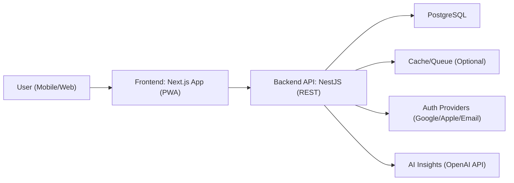
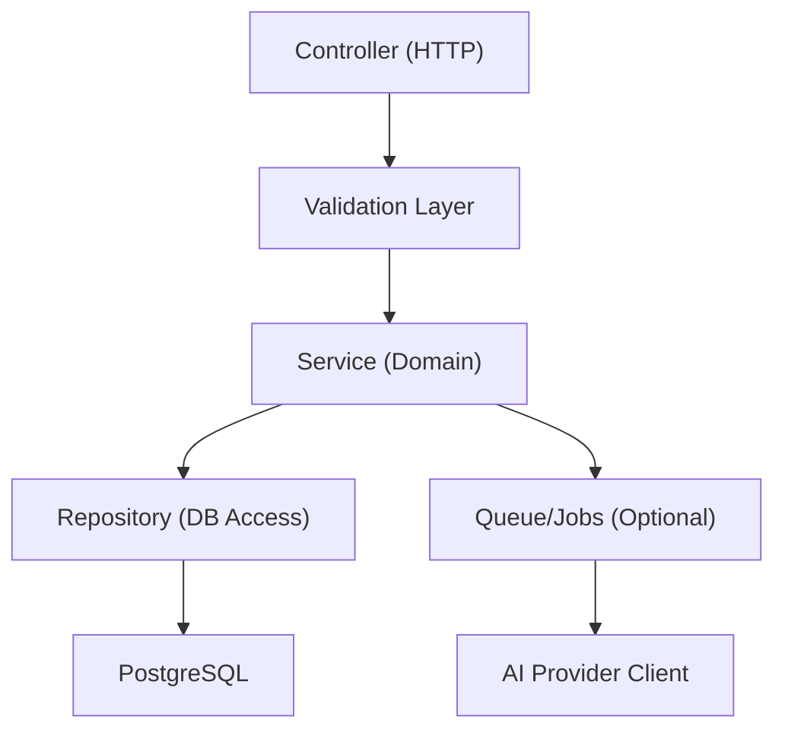
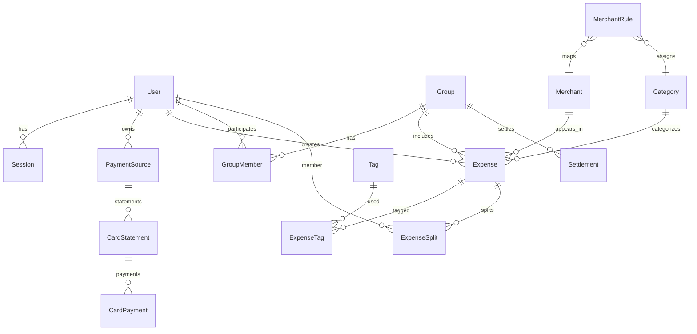

## 1. Architecture Design



Key principles:
- Keep a clean separation between UI (Next.js) and domain logic (NestJS services).
- Treat “shared split” and “card statement cycle” as first-class domain modules.
- Avoid storing sensitive payment data; store card metadata only (issuer/last4/limit).
- Prefer deterministic insights (rules) with optional LLM augmentation gated behind a toggle.

## 2. Technology Description
- Frontend: Next.js (App Router) + React + TypeScript + Tailwind CSS + Framer Motion + Recharts
- Backend: NestJS + TypeScript (REST API)
- Database: PostgreSQL
- Auth: Auth.js / NextAuth-style OAuth (Google, Apple) + Email login, backed by DB sessions
- AI: OpenAI API for insight generation (optional), plus rule-based insight engine
- Exports: Server-side PDF generation + CSV/XLSX export endpoints
- Deployment targets: Vercel (frontend) + Railway/Supabase (Postgres) + containerized API

## 3. Route Definitions (Frontend)
| Route | Purpose |
|-------|---------|
| / | Landing page |
| /auth | Login/register |
| /app | Authenticated app shell redirect to dashboard |
| /app/dashboard | Dashboard summary + quick add |
| /app/expenses/new | Add expense |
| /app/expenses | Expense history + filters |
| /app/shared | Shared overview (groups, balances) |
| /app/shared/groups/[groupId] | Group details + activity + settlement |
| /app/analytics | Analytics charts + insights |
| /app/cards | Card stack + statement timeline |
| /app/cards/[cardId] | Card detail + statements + payments |
| /app/reports | Monthly reports + export |
| /app/categories | Category + tag management + merchant rules |
| /app/notifications | Alerts + preferences |
| /app/settings | Profile + budgets + data export/delete |

## 4. API Definitions (Backend)

### 4.1 Conventions
- Base URL: /api/v1
- Auth: session cookie (httpOnly, secure, sameSite=strict) or bearer token for mobile/PWA contexts
- Validation: schema validation for all request bodies; reject unknown fields
- Errors: consistent error envelope with machine code + user-safe message

### 4.2 Core Types (TypeScript)
```ts
export type Money = {
  amountMinor: number;
  currency: string;
};

export type PaymentSourceType = "CREDIT_CARD" | "DEBIT_CARD" | "UPI" | "CASH" | "WALLET";

export type ExpenseKind = "PERSONAL" | "SHARED";

export type SplitMethod = "EXACT" | "EQUAL" | "PERCENTAGE";
```

### 4.3 Auth
| Method | Path | Purpose |
|--------|------|---------|
| GET | /auth/session | Return current session user |
| POST | /auth/logout | Invalidate session |

### 4.4 Expenses
| Method | Path | Purpose |
|--------|------|---------|
| GET | /expenses | List expenses with filters (month, source, category, merchant, shared, tags) |
| POST | /expenses | Create expense (personal or shared) |
| GET | /expenses/:id | Get expense detail |
| PATCH | /expenses/:id | Update expense (with audit trail) |
| DELETE | /expenses/:id | Delete expense (soft delete) |

Create expense (request)
```json
{
  "occurredAt": "2026-05-11T10:00:00.000Z",
  "money": { "amountMinor": 34900, "currency": "INR" },
  "merchantName": "Swiggy",
  "categoryId": "cat_food_delivery",
  "paymentSourceId": "ps_hdfc_swiggy",
  "tags": ["late-night"],
  "kind": "SHARED",
  "shared": {
    "groupId": "grp_family",
    "splitMethod": "EXACT",
    "paidByUserId": "usr_me",
    "participants": [
      { "userId": "usr_me", "shareMinor": 14900 },
      { "userId": "usr_sister", "shareMinor": 20000 }
    ]
  }
}
```

### 4.5 Shared Groups + Settlement
| Method | Path | Purpose |
|--------|------|---------|
| GET | /groups | List groups |
| POST | /groups | Create group |
| GET | /groups/:groupId | Group details |
| POST | /groups/:groupId/members | Invite/add members |
| GET | /groups/:groupId/balances | Net balances per member (Splitwise-style) |
| POST | /groups/:groupId/settlements | Record settlement payment |

### 4.6 Categories, Merchants, Rules
| Method | Path | Purpose |
|--------|------|---------|
| GET | /categories | List categories |
| POST | /categories | Create category |
| GET | /merchants | Merchant search + recents |
| POST | /merchant-rules | Create/update merchant → category mapping |

### 4.7 Payment Sources (Cards/UPI/Cash)
| Method | Path | Purpose |
|--------|------|---------|
| GET | /payment-sources | List payment sources |
| POST | /payment-sources | Create payment source (card metadata, UPI handle, wallet name) |
| PATCH | /payment-sources/:id | Update |

### 4.8 Card Statements + Payments
| Method | Path | Purpose |
|--------|------|---------|
| GET | /cards | List credit cards |
| GET | /cards/:cardId/statements | Statement list |
| POST | /cards/:cardId/statements/lock | Lock/generate statement for cycle |
| POST | /cards/:cardId/payments | Record payment (partial/full) |
| GET | /cards/:cardId/dues | Current due + carry-forward |

### 4.9 Reports + Export
| Method | Path | Purpose |
|--------|------|---------|
| GET | /reports/monthly | Monthly report summary |
| GET | /exports/monthly.pdf | Download PDF report |
| GET | /exports/monthly.csv | Download CSV |
| GET | /exports/monthly.xlsx | Download Excel |

### 4.10 Insights (Rule-based + AI)
| Method | Path | Purpose |
|--------|------|---------|
| GET | /insights/monthly | Generated insights for selected month |
| POST | /insights/refresh | Recompute insights (rate limited) |

## 5. Server Architecture Diagram


Modules (NestJS):
- AuthModule
- ExpensesModule
- GroupsModule
- SettlementModule
- CategoriesModule
- MerchantsModule
- PaymentSourcesModule
- CardStatementsModule
- ReportsModule
- ExportsModule
- InsightsModule

## 6. Data Model

### 6.1 Data Model Definition (ER)


### 6.2 Data Definition Language (PostgreSQL)
```sql
create table users (
  id text primary key,
  email text unique,
  name text,
  avatar_url text,
  created_at timestamptz not null default now()
);

create table sessions (
  id text primary key,
  user_id text not null references users(id) on delete cascade,
  expires_at timestamptz not null
);

create table categories (
  id text primary key,
  user_id text not null references users(id) on delete cascade,
  name text not null,
  parent_id text references categories(id) on delete set null,
  created_at timestamptz not null default now()
);

create table tags (
  id text primary key,
  user_id text not null references users(id) on delete cascade,
  name text not null,
  created_at timestamptz not null default now(),
  unique (user_id, name)
);

create table merchants (
  id text primary key,
  user_id text not null references users(id) on delete cascade,
  name text not null,
  created_at timestamptz not null default now(),
  unique (user_id, name)
);

create table merchant_rules (
  id text primary key,
  user_id text not null references users(id) on delete cascade,
  merchant_id text not null references merchants(id) on delete cascade,
  category_id text not null references categories(id) on delete restrict,
  confidence int not null default 100,
  created_at timestamptz not null default now(),
  unique (user_id, merchant_id)
);

create table payment_sources (
  id text primary key,
  user_id text not null references users(id) on delete cascade,
  type text not null,
  name text not null,
  issuer text,
  last4 text,
  credit_limit_minor bigint,
  billing_cycle_day int,
  due_day int,
  created_at timestamptz not null default now()
);

create table groups (
  id text primary key,
  owner_user_id text not null references users(id) on delete cascade,
  name text not null,
  created_at timestamptz not null default now()
);

create table group_members (
  id text primary key,
  group_id text not null references groups(id) on delete cascade,
  user_id text not null references users(id) on delete cascade,
  role text not null default 'MEMBER',
  created_at timestamptz not null default now(),
  unique (group_id, user_id)
);

create table expenses (
  id text primary key,
  user_id text not null references users(id) on delete cascade,
  occurred_at timestamptz not null,
  amount_minor bigint not null,
  currency text not null,
  merchant_id text references merchants(id) on delete set null,
  merchant_name text,
  category_id text references categories(id) on delete set null,
  payment_source_id text references payment_sources(id) on delete set null,
  kind text not null,
  group_id text references groups(id) on delete set null,
  notes text,
  created_at timestamptz not null default now(),
  updated_at timestamptz not null default now(),
  deleted_at timestamptz
);

create index expenses_user_occurred_idx on expenses(user_id, occurred_at desc);
create index expenses_user_kind_idx on expenses(user_id, kind);
create index expenses_user_group_idx on expenses(user_id, group_id);

create table expense_splits (
  id text primary key,
  expense_id text not null references expenses(id) on delete cascade,
  user_id text not null references users(id) on delete cascade,
  share_minor bigint not null,
  created_at timestamptz not null default now(),
  unique (expense_id, user_id)
);

create table expense_tags (
  expense_id text not null references expenses(id) on delete cascade,
  tag_id text not null references tags(id) on delete cascade,
  primary key (expense_id, tag_id)
);

create table card_statements (
  id text primary key,
  payment_source_id text not null references payment_sources(id) on delete cascade,
  period_start date not null,
  period_end date not null,
  locked_at timestamptz,
  due_amount_minor bigint not null default 0,
  carry_forward_minor bigint not null default 0,
  created_at timestamptz not null default now(),
  unique (payment_source_id, period_start, period_end)
);

create table card_payments (
  id text primary key,
  card_statement_id text not null references card_statements(id) on delete cascade,
  paid_at timestamptz not null,
  amount_minor bigint not null,
  created_at timestamptz not null default now()
);

create table settlements (
  id text primary key,
  group_id text not null references groups(id) on delete cascade,
  from_user_id text not null references users(id) on delete cascade,
  to_user_id text not null references users(id) on delete cascade,
  amount_minor bigint not null,
  currency text not null,
  settled_at timestamptz not null,
  created_at timestamptz not null default now()
);
```

Recommended indexes and constraints:
- Unique constraints for (user_id, merchant_name) to power “merchant memory”
- Partial index on expenses where deleted_at is null
- Enforce kind=SHARED implies group_id not null (via application validation + optional DB constraint)

## 7. Security + Compliance Notes
- Store card metadata only (issuer, last4, limits); never store full PAN or CVV.
- Encrypt any user secrets (if introduced later) using server-managed keys and envelope encryption.
- Rate limit: login, expense creation, exports, insights refresh.
- Prevent XSS: strict CSP, sanitize user-generated text fields, avoid dangerouslySetInnerHTML.
- Prevent SQL injection: parameterized queries via ORM.
- Audit trail: record expense updates and split changes for reconciliation.
